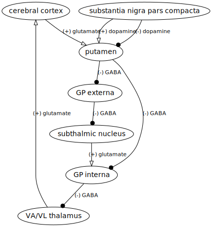
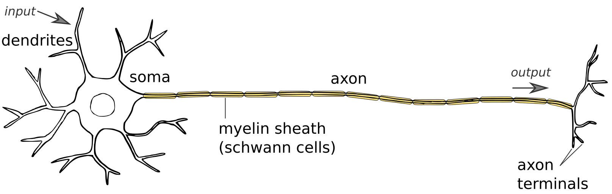

This repository contains scalable vector graphics (svg) content for open usage by our research group and the greater public community.

Content in this repo should be contributed with the intention of being openly shared and compatible with the Creative Commons Public domain license [CC0](https://creativecommons.org/share-your-work/public-domain/cc0/) to the greatest extent possible. Please feel free to contribute.

## What is svg?

[Scalable Vector Graphics (svg)](https://en.wikipedia.org/wiki/Scalable_Vector_Graphics) is an open W3C standard for 2D vector graphics exchange over the world wide web. It is just a markup (xml) specification. svg files can be created, opened, and edited with any **plain text editor**. svg content can also be created with many open source or proprietary interactive graphics programs and can be viewed with any web browser. In the context of a web application, svg can be styled with css and scripted/animated with JavaScript.

## Notes

The type of svg graphics added to this git repo should primarily be a mix of simple line drawings, shading, and text. *Usage of raster/image data should be minimized.* Though svg files can contain images-- either as embedded data or as a hypertext link to remote url-- embedded images get encoded as a [base64 data format](https://developer.mozilla.org/en-US/docs/Web/HTTP/Basics_of_HTTP/Data_URIs) in svg graphics files. Base64 is a highly portable, but less efficient (e.g wasteful) way of storing real image data compared with raster formats like png/jpeg). Thus if the desired content does not require too many individual objects, it should just be composed as a vector graphic.

Graphics from here can then be openly patched into more complex figure/svg graphics for other projects.

All are welcome to contribute. The free and open source [Inkscape](https://inkscape.org) drawing program is highly recommended for creating or editing svg graphics figures. Libreoffice has some nice diagramming tools as well. Graphviz (dot language) is good for diagrams of networks.

<!-- Recommended workflow is to clone this repo locally, then make a working branch for yourself separate from the master branch while working on collaborative changes or adding new content. Then merge the changes with master. -->

### Network diagrams

With the open source graph visualization software [GraphViz](http://www.graphviz.org/) locally installed, the plain text `.dot` files can be edited and then rendered with a command like this:  

`dot ppc-circuits.dot -Tsvg -o ppc-circuits.svg`

<figure>

<figcaption>Sample content.</figcaption>
</figure>

html alone:

full link: 

md link:

